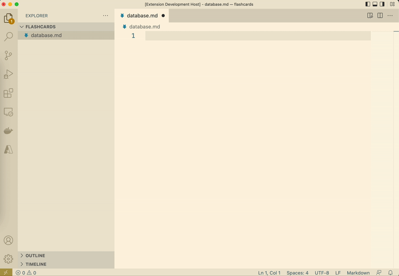
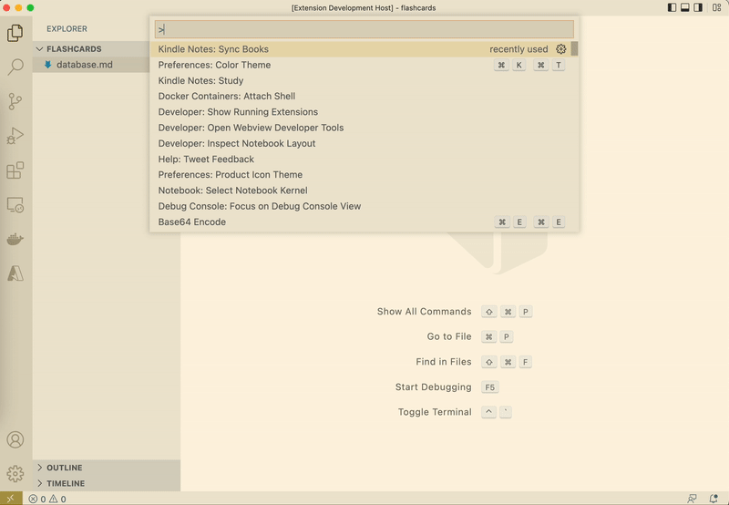

# Kindle Notes

Create `flashcards` with Spaced Repetition from your notes. Syncing notes and highlights from your `Kindle`.

You learn many interesting things every day by researching or reading books but easily forget if do not revise after some time. This extension allows you to:
- create `flashcards` in `markdown` format
- sync notes and highlights from your `Kindle` and save them as `flashcards`
- revise `flashcards`

I use this extension daily for my `long-term memory`. Hope it helps you as well!

## Feature highlights

- create `flashcards` in `markdown` format
- sync notes and highlights from your `Kindle`
- `Spaced Repetition` to revise `flashcards`
- auto format and generate metadata for books and flashcards
- provide links to open Kindle and Markdown while reviewing a flashcard

## Get started

- create an empty `flashcards` directory and open it with `VS Code`
- run command `Kindle Notes: Study` and browse to the `flashcards` directory
- add a book file (e.g. `database.md`), add some flashcards and run `Kindle Notes: Study This File` to revise
- run `Kindle Notes: Sync Books`, enter `email`, `password` to sync books with your Kindle
- (optional) commit and push to Github

## Preview

- create `flashcards` in `markdown` format



- sync notes and highlights from your `Kindle`



## Commands

- `Kindle Notes: Study`: study flashcards from a random books
- `Kindle Notes: Study This File`: study flashcards from the current `markdown` book
- `Kindle Notes: Sync Books`: to sync books from your Kindle. Notice that, the extension will ask you for `email` and `password` to login to `Kindle`. The credentials will be kept locally on your machine only.

## Format

- Follows [CommonMark](https://commonmark.org/)
- Additional syntax for metadata and side seperator (`%%`)

```
---
id: id of the book     <-- auto generated
name: Name of the book
---

##                     <-- starting point of the flashcard
(frontside content)

%%                     <-- seperator between front and backside
(backside content)

<!--                   <-- flashcard metadata. Auto generated
src: kindle
hash: (hash value)     <-- to identify a flashcard in the book
page: 301              <-- page of the notes or highlights in Kindle
-->

##
Next flashcard
```

## Configs

| Name | Description | Default Value |
| ---- | ----------- | ------------- |
| Kindle notes: Flashcards Home Path | Path to the flashcards repo directory. Will be asked the first time you use the extension | |
| Kindle-notes: Headless Browser | `true` to show Chromium browser while syncing notes and highlights from Kindle | `false` |
| Kindle-notes: Show Logger | Specify whether the logger UI will popup or not | `false` |
| Kindle-notes: Kindle Email | Email using to login to Kindle. Will be asked the first time you use the `Sync Books` command | |
